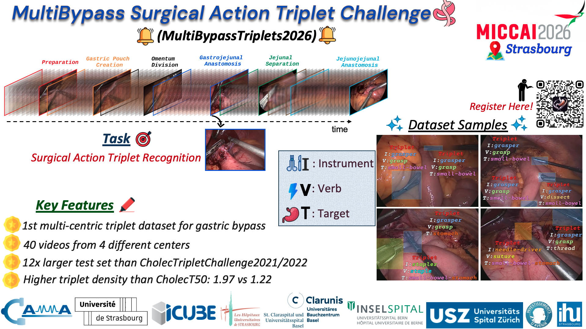

# MultiBypassTriplets2026 (MultiSAT) Starter Kit

⚡ A starter kit to quickly run a baseline model, train, and evaluate on surgical action triplet recognition.



## 🧭 Abstract

This repository is designed for fast experimentation:

- ✅ Train a model from `main.py`
- ✅ Evaluate with ivtmetrics adopted using `torchmetrics`
- ✅ Run standalone evaluation from `evaluate.py` by loading a checkpoint
- ✅ Report metrics for `ivt/i/v/t/iv/it` with mAP and F1 score

## 🛠️ Installation

Clone the repository:
```bash
git clone <repo-url>
cd multibypasstriplets2026_starter_kit
```

Conda environment and dependencies:
```bash
conda create -n multisat2026 python=3.11
conda activate multisat2026
pip install torch==2.6.0 torchvision==0.21.0 torchaudio==2.6.0 --index-url https://download.pytorch.org/whl/cu118
pip install transformers==4.56.2
pip install scikit_learn randaugment pycocotools torchmetrics timm peft einops open_clip_torch
pip install termcolor
pip install -r requirements.txt
```

Verify your environment:
```bash
python3 -c "import torch; print(torch.__version__)"
```

## 📦 Dataset Download Instruction

Download the dataset from the challenge link provided by the organizers.
After downloading, place/extract the dataset inside a `data` folder at the repository root (same directory level as `main.py`).
For more details, look inside the README in the dataset folder.

Expected layout:

```text
multibypasstriplets2026_starter_kit/
├── data/
│   └── MultiBypassT40/
│       ├── videos/
│       └── label_files_challenge/
├── main.py
└── ...
```

## 🚀 Training (main.py)

Training references:
- Main training entrypoint: [main.py](main.py)
- Split: [dataset/utils.py](dataset/utils.py)
- Class-weight utilities: [utils/helpers.py](utils/helpers.py)


DINOv3 setup (required for the example model):
- Clone the DINOv3 repository and place it outside this project root as a sibling directory of `multibypasstriplets2026_starter_kit` (same parent folder).
- Place DINOv3 checkpoints inside this repository’s [weights/](weights/) directory.

Start training using provided script:
```bash
bash scripts/train_dinov3_vits16_x1.sh <your_runname> <your_expname>
```

## 🧪 Evaluation (evaluate.py)
Start evaluation using provided script:
```bash
bash scripts/eval_dinov3_vits16_x1.sh <your_runname> <your_expname>
```
Evaluation metrics follow the definitions in [Nwoye et al. (2022)](https://arxiv.org/pdf/2204.05235), and the metric implementation is adapted from [CAMMA-public/ivtmetrics](https://github.com/CAMMA-public/ivtmetrics) using `torchmetrics`.

## 📁 Key Files

- [main.py](main.py): train + validation flow
- [evaluate.py](evaluate.py): eval-only flow with checkpoint loading
- [engine.py](engine.py): train/eval loops
- [utils/args.py](utils/args.py): CLI arguments
- [utils/metric_collater.py](utils/metric_collater.py): torchmetrics-based collation

## 🗂️ Project Structure

```text
multibypasstriplets2026_starter_kit/
├── assets/                      # Challenge figure and static assets
├── dataset/                     # Dataset loaders and transforms
├── models/                      # Model definitions and builders
├── scripts/                     # Ready-to-run train shell scripts
├── utils/                       # Args, metrics, helpers, mappings
├── videos/                      # Local video data (if mounted/copied)
├── weights/                     # Pretrained weights/checkpoints (optional)
├── logs/                        # Training and evaluation outputs
├── main.py                      # Main training + validation entrypoint
├── evaluate.py                  # Eval-only entrypoint (checkpoint -> metrics)
├── engine.py                    # Train/val/test loops
├── requirements.txt             # Python dependencies
└── readme.md                    # Documentation
```

## 📬 Contact

- ✉️ Email: multibypass2026@gmail.com

## 🏛️ Affiliations

- University of Strasbourg, CNRS, INSERM, ICube, UMR7357, France
- IHU Strasbourg
- University Digestive Health Care Center - Clarunis, University Hospital of Basel, Basel, Switzerland
